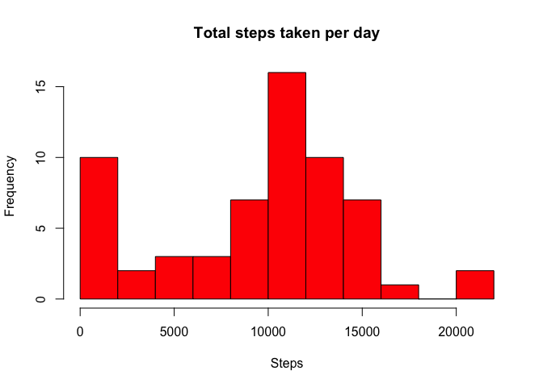
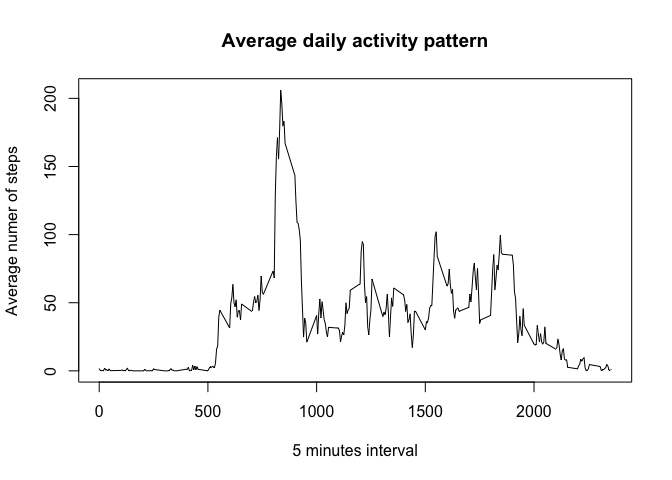
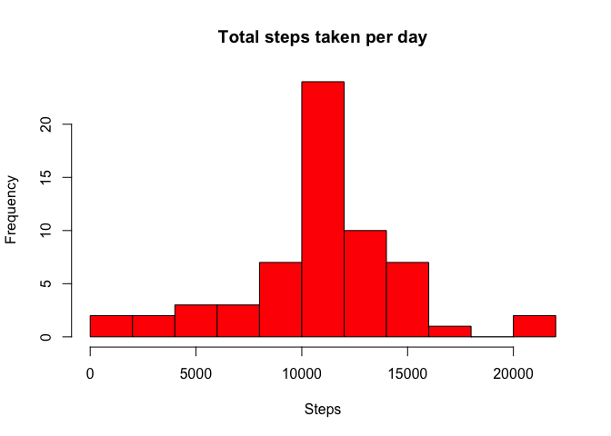
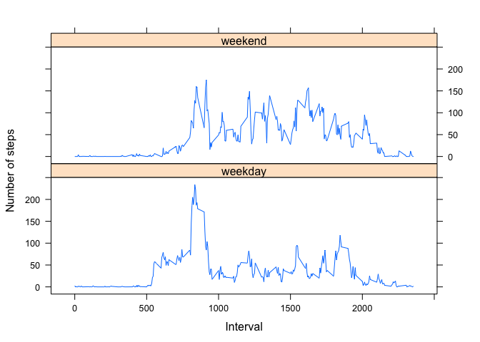

## Loading and preprocessing the data
Unzip and load the data file

```r
unzip("activity.zip")
data = read.csv("activity.csv", header=TRUE, sep=",", na.strings="NA", colClasses=c("numeric", "Date", "numeric"))
```
Show head and summary data

```r
head(data)
```

```
##   steps       date interval
## 1    NA 2012-10-01        0
## 2    NA 2012-10-01        5
## 3    NA 2012-10-01       10
## 4    NA 2012-10-01       15
## 5    NA 2012-10-01       20
## 6    NA 2012-10-01       25
```

```r
summary(data)
```

```
##      steps             date               interval     
##  Min.   :  0.00   Min.   :2012-10-01   Min.   :   0.0  
##  1st Qu.:  0.00   1st Qu.:2012-10-16   1st Qu.: 588.8  
##  Median :  0.00   Median :2012-10-31   Median :1177.5  
##  Mean   : 37.38   Mean   :2012-10-31   Mean   :1177.5  
##  3rd Qu.: 12.00   3rd Qu.:2012-11-15   3rd Qu.:1766.2  
##  Max.   :806.00   Max.   :2012-11-30   Max.   :2355.0  
##  NA's   :2304
```
## What is mean total number of steps taken per day?

```r
numSteps <-aggregate(data$steps, by=list(data$date), FUN=sum, na.rm=TRUE)
hist(numSteps$x, breaks=10, main='Total steps taken per day',xlab='Steps', ylab = "Frequency", col = "red")
```

<!-- -->

```r
meanNrSteps <- format(round(as.numeric(mean(numSteps$x)), 2), nsmall=2, big.mark=",")
medianNrSteps <- format(round(as.numeric(median(numSteps$x)), 2), nsmall=2, big.mark=",")
```
The mean total number of steps taken per day is: 9,354.23

The median total number of steps taken per day is: 10,395.00

## What is the average daily activity pattern?

```r
avgSteps<-aggregate(data$steps, by=list(data$interval), FUN=mean, na.rm=TRUE)
plot(avgSteps$Group.1, avgSteps$x, type = 'l', main = "Average daily activity pattern", ylab = "Average numer of steps", xlab = "5 minutes interval")
```

<!-- -->

```r
maxSteps <- max(avgSteps$x)
maxStepsInterval<-avgSteps[which(avgSteps$x==maxSteps),]$Group.1
```
The interval with maximum average number of steps (206.1698113) is:  835

## Imputing missing values

```r
nrNA <- sum(is.na(data))
```
Number of rows with NA is: 2304
The strategy is to fill in the avgSteps values for all the NA values in data

```r
data2<-data
data2$steps<-avgSteps$x
data3<-data
for(i in 1:nrow(data)) {
  if(is.na(data[i,1])) {
    data3[i,1]<-data2[i,1]
  }
}
rm(data2)
numSteps3 <-aggregate(data3$steps, by=list(data3$date), FUN=sum, na.rm=TRUE)
hist(numSteps3$x, breaks=10, main='Total steps taken per day',xlab='Steps', ylab = "Frequency", col = "red")
```

<!-- -->

```r
meanNrSteps3 <- format(round(as.numeric(mean(numSteps3$x)), 2), nsmall=2, big.mark=",")
medianNrSteps3 <- format(round(as.numeric(median(numSteps3$x)), 2), nsmall=2, big.mark=",")
```
The mean total number of steps taken per day is: 10,766.19 which is higher than the one initially calculated

The median total number of steps taken per day is: 10,766.19 which is higher than the one initially calculated and equal to the mean. 

The graph shows higher frequency for mean/median values

## Are there differences in activity patterns between weekdays and weekends?

```r
library(lattice)
data$Day <- weekdays(data$date)
data$dayType[data$Day=="Saturday"]<-"weekend"
data$dayType[data$Day=="Sunday"]<-"weekend"
data$dayType[is.na(data$dayType)]<-"weekday"
data$dayType<-as.factor(data$dayType)
numSteps<-aggregate(data$steps, by=list(data$interval, data$dayType), FUN=mean, na.rm=TRUE)
xyplot(numSteps$x~numSteps$Group.1|numSteps$Group.2, layout=c(1,2), type="l", xlab="Interval", ylab="Number of steps")
```

<!-- -->


There are differences on the activity patterns between weekends and weekdays
